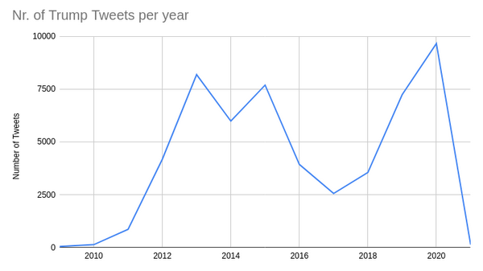
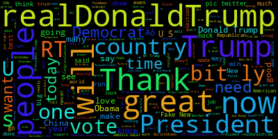
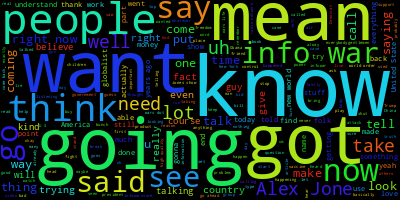

# Project of Data Visualization (COM-480)

| Student's name | SCIPER |
| -------------- | ------ |
| | |
| | |
| | |

[Milestone 1](#milestone-1) • [Milestone 2](#milestone-2) • [Milestone 3](#milestone-3)

## Milestone 1 (23rd April, 5pm)

**10% of the final grade**

This is a preliminary milestone to let you set up goals for your final project and assess the feasibility of your ideas.
Please, fill the following sections about your project.

*(max. 2000 characters per section)*

### Dataset

The goal of our project is to understand the connection between former US president Trump's tweets and conspiracy theorists. Our dataset contains all of Trump's tweets from 2009 to 2021 as well as the transcribed content of 4686 episodes of the Alex Jones show. We believe that this later dataset is a good representation of conspiracy theories.

The dataset containing Alex Jones’ transcriptions is a gzipped 1.2 GB large csv file.
The dataset containing Trump Tweets consists of a 12MB csv file containing over 50k tweets. Given the shutdown of the free Twitter API, we need to rely on such existing restricted datasets for Tweets instead of retrieving more detailed information from the API.

### Problematic

Donald Trump, the former President of the United States, has been known to use conspiracy theories to support his position on various issues.

To gain a better understanding of how Trump's tweets are influenced by real-life events and conspiracy theories, we will create a website that visualizes his tweeting behavior. By analyzing Trump's tweets in the context of significant events and conspiracy theories, we aim to identify patterns and determine the extent to which these factors influence his social media activity.

Moreover, the project also aims to explore how Trump's tweets can impact real-world events and conspiracy theories. Given Trump's significant social media following, his tweets have the potential to spread quickly and influence public discourse, making it important to understand the relationship between his tweets and the broader socio-political landscape.

As a case study, we aim to link Trump’s tweeting behavior to the Alex Jones’ show, demonstrating how the former influences the latter and vice versa.

We aim to create an extensive set of (interactive) graphs on the topic.These include but are not restricted to: 

* Clustering of Tweets/show episodes by conspiracy theories mentioned in Trump’s Tweets and Alex Jones’ show
* Visualizing the overlap of conspiracy theories mentioned in Trump’s Tweets and Jones’ show
    * Overall visualization
    * Historical visualization: how does the overlap evolve over time
    * Visualization of correlation between Trump and Jones: when do Trump’s Tweets mention conspiracy theories that have been mentioned in Alex Jones’ show shortly before and vice versa
* Visualizing “density” of conspiracy theories:
    * How many distinctive conspiracy theories have been referred to by Jones/Trump in one unit of time (TBD, could be for example 1 week)
    * How often have Trump/Jones referred to a certain conspiracy theory in one unit of time (TBD, could be for example 1 week)

### Exploratory Data Analysis

The following graph shows the number of tweets by Trump per year. Interestingly there is a dip in the middle of his presidency. Which implies that for Trump Twitter becomes increasingly valuable before/during elections.

The following wordcloud shows the most used words used in tweets by Trump:

The following wordcloud shows the most used words by Alex Jones:

### Related work

There are a number of projects that are dedicated to analyzing Trump’s tweets. These projects mainly focus on sentiment analysis and behavior over time. A number of these projects also try to correlate his tweets to external events/factors. For example: [Morales, E.A](https://journals.sagepub.com/doi/full/10.1177/19312431211028610) investigates how Trump’s tweets influence the topics of cable/network television. 

To the best of our knowledge, previous analysis has not focussed on data visualization but instead on statistical evaluation.

Additionally, we are the first project that uses the relatively new Alex Jones’ InfoWars dataset [released on 22 March 2023](https://www.reddit.com/r/datasets/comments/11yyoth/4682_episodes_of_the_alex_jones_show_15875_hours/) and correlates this with Trump’s tweets.

Preliminary inspection of the wordclouds shows that further processing is required to make the data usable and extract the data relevant to conspiracy theories. Additionally the data will also need to be analyzed over time and correlated to each other along this axis.

## Milestone 2 (7th May, 5pm)

**10% of the final grade**

## Milestone 3 (4th June, 5pm)

**80% of the final grade**

## Late policy

- < 24h: 80% of the grade for the milestone
- < 48h: 70% of the grade for the milestone

