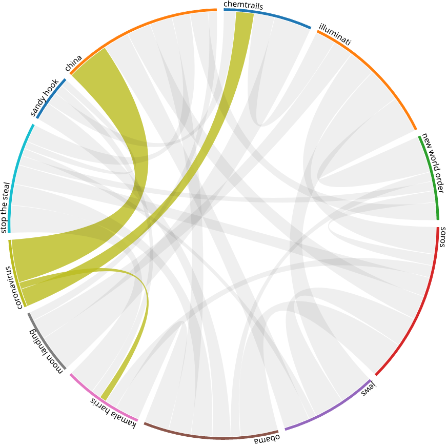

# Introduction

Conspiracy theories have for a long time alredy played an important role in the
history of mankind.
Oftentimes, xenophobic and religious motives played an important role in their
spread.
For example, the big outbreak of the plague in the 14th century caused serious
persecutions of Jews due to conspiracy theories that Jews poisoned wells in
order to extinguish the Christian population in Europe.

While a multitude of conspiracy theories kept getting invented throughout the
centuries, we focus on conspiracy theories with a significant spread since the
turn of the millenia.
More specifically, we focus on conspiracy theories playing an important role in
modern populist politics in the United States of America.

To this extent, we gather and analyze the dataset of Tweets of the former US
President Donald Trump as an important populist politician as well as the
transcriptions of the Infowars podcast published by Alex Jones, an US-American
right-wing populist political activist.

# Obtaining the Dataset

Due to Twitter's API access being severely restricted, we had to rely on
previous dumps of Trump's Tweets.
Luckily, the full set of Donald Trump's Tweets from 2009 until the suspension
of his account in early 2021 is readily available on GitHub
[@hershey2021complete].

The dataset of Trump Tweets has already been the basis of research publications
[@morales2021impact].
As such, we consider this dataset not novel enough to constitute the sole
source of data for our visualization.

Consequently, we obtained the full dataset of transcripts of Alex Jones'
Infowars podcast only recently published [@simonsen2023infowars].
This dataset has been created by transcribing the podcast episodes with
OpenAI's Whisper speech-to-text engine [@simonsen20234682].
The dataset consists of 187'748'262 words of text, adding up to 1.2 GB of
textual data.
To the best of our knowledge, we are the first project to conduct extensive
analysis on this dataset due to its recency.

During the implementation phase of our project, we found the Trump Tweet
dataset to be too sparse for meaningful analysis and comparisons with relation
to conspiracy theories.
As a result, we shifted the focus of our visualization from a comparison of
Alex Jones' and Donald Trump's views on conspiracy theories to a comparison
between Alex Jones' views reported in the Infowars podcast and news covered in
different US-American media outlets.

This latter dataset provides us with 2.7 million news articles from the years
2016-2020, amounting to roughly 8.8 GB of textual data [@thompson2022all].

In order to prepare the textual data for further analysis, we trained a
Word2Vec model [@mikolov2013efficient; @mikolov2013distributed] on the
datasets.
This preprocessing step allows us to extract connections between conspiracy
theories in our visualization.

A copy of our underlying dataset including the Word2Vec model we trained can be
obtained at <https://go.epfl.ch/com480-conspiracies>.

# Designing the Visualization

Our visualization focuses on how conspiracy theories evolve over time and how
the views of different sources on the theories differ.
For the former purpose, we highlight semantic connections between conspiracy
theories and their development over time.
Thus, a consumer of our visualization can for each conspiracy theory we focus
on deduce what other conspiracy theories developed in parallel and what causal
relationships between conspiracy theories may exist.

To achieve visualizing these relationships, a timeline which shows the
frequency of specific terms in our dataset per conspiracy theory is combined
with a chord chart highlighting the connections between theories.
The width of the chords in the graph determines the contextual closeness of two
conspiracy theories.
This contextual closeness implies a correlation: either the conspiracy theories
exhibit an overlap in affected topics and likely stem from the same motives
behind them (xenophobia, homophobia, antisemitism, etc.) or that one of them
developed into the other over time.
The type of this correlation can be determined by observing the development
over time of the theories in the aforementioned timeline.

Given that we cannot assume that every page visitor is familiar with the
conspiracy theories presented, hovering over a conspiracy theory also provides
the reader with contextual information.

In order to visualize how different sources (i.e., Alex Jones and different
classic US-American media outlets and news agencies report about conspiracy
theories, we once again leverage a timeline.
In this graph, a page visitor can select and deselect data sources for a given
conspiracy theory to plot the development over time across sources.
This provides the viewer with an insight into the temporal relationship of
references to a conspiracy theory across classic media outlets and Alex Jones'
Infowars podcast.

On the other hand, we refrain from providing a wordcloud with conspiracy
theories as we had originally intended.
During the implementation of our visualization, we encountered issues with the
sparsity of the wordcloud.
We consequently decided to remove the wordcloud from our final visualization
and focus on the timelines and chord charts instead.

# Implementing the Visualization

As we already referred to in the previous sections, we encountered multiple
difficulties during the implementation of our visualization.
In this section, we describe the steps we took, what difficulties we
encountered, as well as how we have overcome those difficulties and what the
effect on our implementation is.

As already mentioned above, the Trump Tweets dataset was too sparse for our
visualization which is why we will not extensively cover the processing steps
for this dataset in the following.

## Data Preprocessing

The different datasets require different preprocessing steps, depending on
their format.

The Infowars dataset consists of raw text files with one file per episode.
The filename encodes the date of the podcast episode, the file itself contains
the raw transcription of the corresponding episode.

For training the Word2Vec model which we use for establishing links between
the conspiracy theories, we simply concatenate the full transcription and train
the model on this full text dataset.

The news dataset contains news articles for 27 US-American media outlets and
news agencies in the CSV format.
Each row in the corresponding CSV file contains the publication date of the
article, the article itself, and the publisher, among other metadata such as
a link to the online article.
This dataset required preprocessing due to formatting errors in the CSV.
In some but not all cases, newlines in the article contents caused newlines in
the CSV, breaking the format and preventing successful parsing.
In one of our preprocessing steps, we automatically fix those formatting errors
for further processing.

## Data Analysis

After training a Word2Vec model and fixing formatting issues in our dataset, we
analyze the data and extract the information for our visualization.

In order to show the connection between certain conspiracy theories in a chord
chart, we calculate the cosine similarity between terms identifying the
theories based on our previously trained Word2Vec model.
As an example, the conspiracy theory around the _New World Order_[^nwo] shows
strong links to the _Illuminati_[^illuminati] and _George Soros_[^soros] in our
analysis, which is in line with the conspiracy theory's main message that a
secret society (here: the Illuminati) lead by rich and influential people
(here: George Soros) are controlling the world via a secret world government.

For showing the development over time in popularity, we count the occurrences
of terms related to the conspiracy theories over time per media outlet
(including Alex Jones' Infowars podcast) and plot them in a line graph per
conspiracy theory.
This allows us to have a direct comparison by how different topics are treated
in different media outlets, especially with reference to the Infowars podcast.

For the implementation of those line charts, we had to make certain compromises
regarding our datasets.
First, the news articles dataset spans from January 2016 to April 2020, whereas
the Infowars dataset reaches back to 2001 and contains episode transcriptions
up until the present days.
In order to have a meaningful comparison between news reports and the Infowars
dataset, we needed to restrict the latter to the same timespan as the former in
the aforementioned line graphs.

Second, the news dataset was too sparse for certain media outlets, which is why
we needed to exclude those from the final plots.
As an example, out of the 27 million news articles in the dataset, only about
27'000 were from Fox News and these articles were not uniformly distributed
over time but strongly concentrated around a few dates.
We can therefore not achieve enough statistical significance over the full time
span to meaningfully show data for Fox News.
Especially for this media outlet, the corresponding graphs would have been very
interesting to analyze due to its known closeness to right-wing politicians and
conspiracy theorists.

## Visualizations

While we acknowledge that using certain development frameworks for Javascript
code can speed up development, we nevertheless decided to resort to [vanilla
Javascript](http://vanilla-js.com/) without leveraging additional
functionalities provided by libraries and frameworks such as JQuery or
React.js.
We took this decision for multiple reasons, among others to prevent dependency
conflicts, maintain high performance and a lightweight code base as well as
preventing issues with browser support.

### Line Plots (Popularity of Conspiracy Theories Over Time)

The line plots are created using D3.js' line plotting functionality, with the
x-axis being a time scale and the y-axis being a linear scale.
We create one line plot per conspiracy theory with a line per media outlet.
The lines can be shown or hidden per media outlet via checkboxes below the
graph.
This allows easier comparison of selected data sources in case the graph is too
cluttered when all sources are selected. 

Code snippet [@lst:timeline] shows how each line is plotted.
Note that by default each line has an opacity of 0 and is consequently hidden
unless selected by the corresponding checkbox and that each line is assigned a
custom class for styling and for simple selection in the code to hide or unhide
a line.

~~~{#lst:timeline .javascript .numberLines caption="Code for creating the lines in the timeline graphs"}
publications.forEach((label, i) => {
	svg.append("path")
		.datum(timedata)
		.attr("fill", "none")
		.attr("stroke", color(label))
		.attr("stroke-width", 1.5)
		.attr("class", "lineplot_pub_"+label.join("_"))
		.attr("opacity", "0")
		.attr("d", d3.line()
			.x(function(d) { return x(d["date"]) })
			.y(function(d) { 
				return y(d[label.join(" ")]) 
			})
		)
})
~~~

### Chord Chart (Links Between Conspiracy Theories)

For our chord chart, we again leverage functionality built into D3.js.
In this case, we use a directed chord graph via \texttt{d3.chordDirected}.
The ribbon color in the chord chart depends on the selected conspiracy theory.
The ribbon width encodes the cosine similarity determined in our data analysis
step.

By default, all ribbons are greyed out.
Hovering over one of the conspiracy theories highlights the corresponding
ribbons and shows a brief description of the corresponding conspiracy theory.
Clicking on the theory makes this selection permanent and the permanent
selection can be disabled again by clicking outside of the chord chart.

[@Fig:chord] provides an example for this chord chart with the coronavirus
complex highlighted.
As expected, the chord chart exhibits a strong link towards the China complex,
with an interesting relations to chemtrails as well.

{#fig:chord}

# Peer Assessment

Throughout the duration of the project, the workload was distributed uniformly
across the team members.
Nevertheless, each team member contributed mainly to a certain part of our
visualization.

_Florian Hofhammer_ contributed to dataset collection and preprocessing.
The latter was joint effort with _Luca Di Bartolomeo_.
_Florian Hofhammer_ also was responsible for the initial setup of the project,
the development environment and automated deployment of the website as well as
most of the documentation throughout the project.

_Luca Di Bartolomeo_ created the first draft of the website and focused mostly
on the Word2Vec data processing due to his previous experience in this area.
In addition, he was responsible for the implementation of the chord chart and
general bug fixing in the Javascript code.

_Philipp Mao_ took care of the implementation of the timelines and general
website design tasks.
He spent significant efforts in the responsiveness of the website and automatic
updates and transitions between different selected elements.
He also took care of writing a script for the screencast.

# Conclusion

At the beginning of the semester, we chose a very ambitious dataset.
The dataset does not contain numerical data that can easily be visualized,
consequently requiring extensive preprocessing and information extraction.
During this process, we encountered multiple issues with our dataset and our
originally intended visualizations, requiring us to pivot both to a different
dataset than originally intended as well as different visualization methods.

Consequently, the final implementation differs from the previously submitted
milestones in multiple regards.
Nevertheless, we are convinced that our visualization sheds light on the
prevalence of conspiracy theories in the US-American media landscape and allows
a visitor to gain insights into the train of thought of Alex Jones in his
Infowars podcast through connections in between conspiracy theories and their
development over time.

# References

[^nwo]: <https://en.wikipedia.org/wiki/New_World_Order_(conspiracy_theory)>
[^illuminati]: <https://en.wikipedia.org/wiki/Illuminati>
[^soros]:<https://en.wikipedia.org/wiki/George_Soros_conspiracy_theories>
